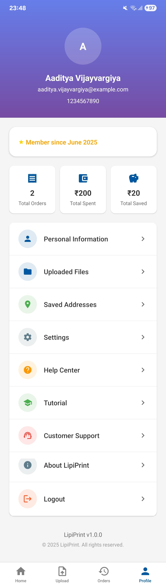

# LipiPrint App

A modern, full-stack print management platform for users and admins. Built with React Native (frontend) and Java Spring Boot (backend).

---

## 🚀 Project Overview
LipiPrint is a smart, easy, and fast printing solution for users and admins. Users can upload documents, customize print jobs, track orders, and manage their profiles. Admins can manage orders, users, analytics, payments, and more via a beautiful dashboard.

---

## ✨ Features

### User App
- Upload and manage files (PDF, DOC, images, etc.)
- Place print orders with custom options
- Track order status in real-time
- View invoices and payment history
- Manage addresses and profile
- Access help center and support

### Admin Dashboard
- View and manage all orders (status, files, payments)
- Bulk and individual file management
- User management (block/unblock, view details)
- Analytics dashboard (orders, revenue, users, trends)
- Reconciliation for failed payments
- Service and settings management
- Modern UI with quick actions, filters, and activity feed

---

## 🛠️ Tech Stack
- **Frontend:** React Native (Android & iOS), React Navigation, Vector Icons, Animatable, LinearGradient, RNFS, RNPrint
- **Backend:** Java Spring Boot, JPA/Hibernate, PostgreSQL, Firebase Storage
- **Other:** Expo (for dev), REST API, JWT Auth, Google Cloud Service Account

---

## 📁 Folder Structure
```
New folder/
  backend/         # Java Spring Boot backend
    src/main/java/com/lipiprint/backend/...
    src/main/resources/
    pom.xml
  frontend/        # React Native app
    src/
      components/
      screens/
      services/
      navigation/
      theme/
      utils/
    App.tsx
    package.json
```

---

## ⚡ Setup Instructions

### Backend (Spring Boot)
1. `cd backend`
2. Configure your database in `src/main/resources/application.properties`.
3. Place your Firebase `serviceAccountKey.json` in `src/main/resources/`.
4. Run migrations: `psql -U <user> -d <db> -f src/main/resources/setup-database.sql`
5. Start server: `./mvnw spring-boot:run` or use your IDE.

### Frontend (React Native)
1. `cd frontend`
2. Install dependencies: `npm install` or `yarn`
3. For Android: `npx react-native run-android`
4. For iOS: `cd ios && pod install && cd .. && npx react-native run-ios`
5. Configure API endpoints in `src/config/production.js` if needed.

---

## 📱 Usage Guide

### User App
- **Home:** Quick actions for upload, orders, print options, profile.
- **Upload:** Select and upload files from device/cloud.
- **Orders:** View, track, and manage your print orders.
- **Profile:** Edit info, addresses, settings, help center.

### Admin Dashboard
- **Dashboard:** Stats, quick actions, recent activity.
- **Manage Orders:** Filter, update, and view order details. Download/print files, mark as completed/delivered.
- **Users:** Block/unblock, view user details.
- **Analytics:** Visualize trends and key metrics.
- **Reconciliation:** Handle failed payments and unmatched payments.
- **File Manager:** View and delete delivered files.

---

## 🖼️ Screenshots

### User App
| Home | Files Uploaded | Orders | Order Confirmation | Invoice | Payment | Razorpay | Delivery Option | Print Option | Selected Print Option | Track Order | Tutorial | Help Center | Customer Support | Settings | Personal Information | Profile | Upload File |
|------|----------------|--------|-------------------|--------|--------|----------|----------------|-------------|----------------------|------------|----------|-------------|------------------|---------|---------------------|---------|------------|
|  |  |  |  |  |  |  |  |  |  |  |  |  |  |  |  |  |  |

### Admin Dashboard
| Home | Manage Orders | Order Details | Analytics | Manage Users | Available Services | Settings |
|------|--------------|--------------|-----------|--------------|--------------------|----------|
|  |  |  |  |  |  |  |

### Common Screens
| Splash | Sign In | Sign Up |
|--------|--------|--------|
|  |  |  |

---

## 🗄️ API & Database Notes
- RESTful API endpoints for all resources (orders, users, files, payments, etc.)
- JWT-based authentication for users and admins
- PostgreSQL schema with foreign key constraints
- File uploads stored in Firebase Storage
- Cascade deletes for orders, print jobs, and payments

---

## 🚫 Contributing
External contributions are not accepted for this project. Please do not submit pull requests or attempt to reuse the codebase.

## ⚠️ Copyright & Legal Notice
All code, designs, and assets in this repository are the intellectual property of the project owner. Copying, redistributing, or using any part of this project without explicit written permission is strictly prohibited and will result in legal action for copyright infringement.

---

## 📄 License
This project is proprietary and not open source. All rights reserved. 